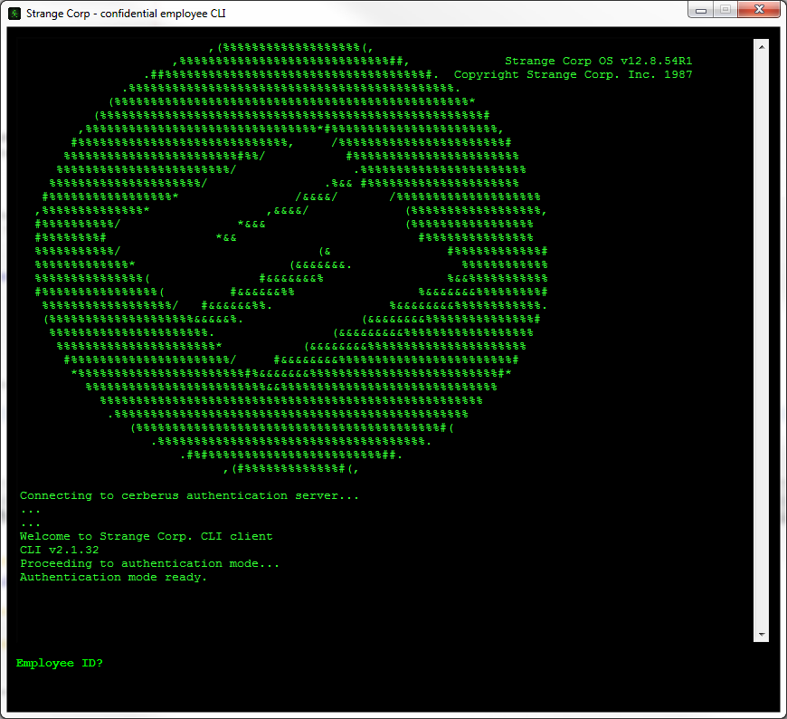

# EscapeCLI a Q&D CLI (Command Line Interface)for solving an escape room

Built within very few time for organizing a mini escape room for the 15-years party of our company.

It works with a fake authentication system using an employee ID and a password and a code extracted from book pages.

Everything is nasty-coded and hardcoded.

I hope to make it configurable in later versions.

